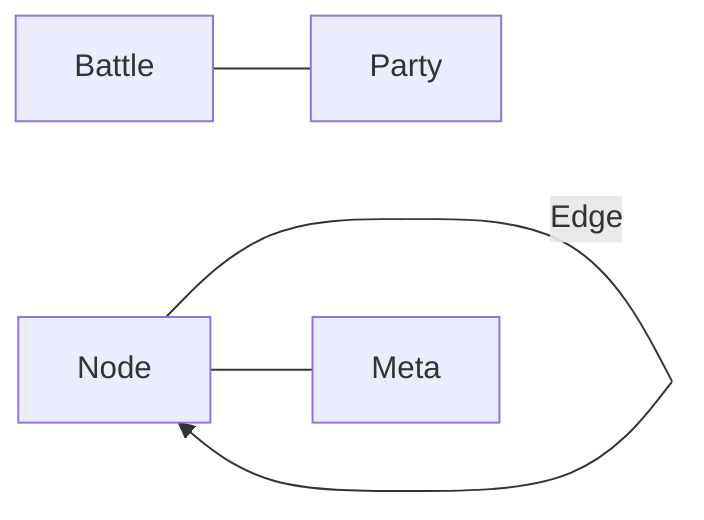

## 상위/연관
- 상위: [[GDD/[IDX] 인덱스]]  
- 연관: [[GDD/시스템/[SYS] 스토리 분기 시스템]] · [[GDD/시스템/[SYS] 턴제 전투 시스템]]

---

## 상세 사양(병합 본문)

## 스키마 개요


## 노드/엣지
```json
{
  "Node": {"id":"N-xxx","type":"episode|battle|ending","title":"","requirements":[],"onEnter":[],"onExit":[]},
  "Edge": {"id":"E-xxx","from":"N-xxx","to":"N-yyy","kind":"auto|choice|prob","label":"","conditions":[],"effects":[],"priority":0}
}
```

## 전투/유닛/스킬
```json
{
  "Unit": {"id":"C-001","hp":28,"hpMax":28,"mp":10,"spd":7,"atk":7,"def":2,"position":2,"skills":["SK-01","SK-03"]},
  "Skill": {"id":"SK-01","from":[1,2],"to":[1,2],"type":"strike","hits":1,"acc":0.9,"coeff":1.0},
  "Battle": {"allyMax":5,"enemyMax":10,"enemies":["E-101","E-102"],"reward":["gold"],"seed":12345}
}
```

## 파티/정비/상태 지속
```json
{
  "Party": {"members":["C-001","C-014","C-022",null,null],"positions":{"C-001":1},"consumables":["응급약"]},
  "Persist": {"hpCarryOver":true,"mpCarryOver":true,"stressCarryOver":true,"injuries":[],"campHealing":{},"cityHealing":{}}
}
```

## 검증 항목
- ID 참조 무결성(존재/타입 일치)  
- 조건/효과 스키마 일관성  
- 전투 스킬 위치 제약 필드 누락 없음
