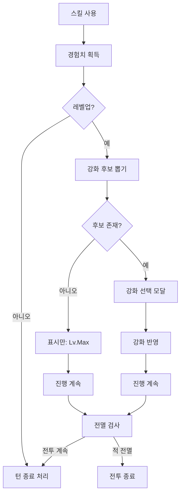
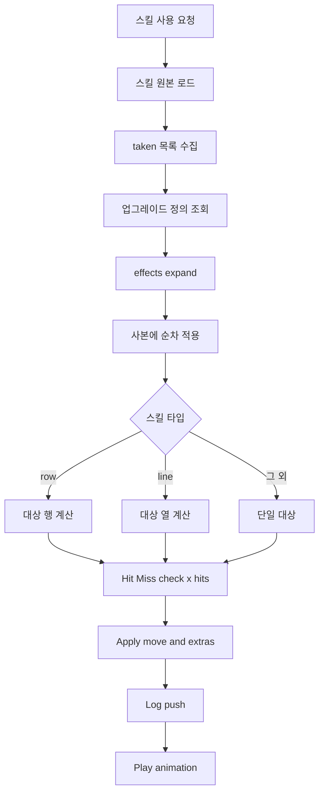

### 스킬 강화(레벨업) 시스템

본 문서는 현재 구현된 "스킬 경험치/레벨업/강화" 시스템을 정리한다. 전투 중 사용한 스킬은 경험치를 획득하고, 레벨업 시 즉시 강화 선택 UI가 뜬다. 선택된 강화는 곧바로 전투 수치에 반영된다.

핵심 요약
- 대상: 오직 아군 유닛의 액티브 스킬만 경험치/레벨업 적용(적은 제외)
- 경험치: 스킬 1회 사용 기준으로 획득(다단히트/광역 여부 무관)
  - 지원형(heal/regen/shield): 100% 획득
  - 그 외: 명중 실패만 있었던 경우 50% 획득, 적중이 1회라도 있으면 100%
- 레벨업: 턴 종료 직후 즉시 발동, 강화 3개 중 1개 선택(없으면 스킵)
- 강화 종류: once(1회만) / stack(중첩 가능)
- 저장 범위: 회차(run) 동안 유지, 리셋 시 초기화

설정 값(코드 반영)

| 키        |  기본값 | 설명                      |
| -------- | ---: | ----------------------- |
| baseGain |   10 | 1회 사용 시 기본 경험치          |
| missMul  |  0.5 | 지원형 외에 전부 miss였을 때 보정   |
| baseNext |   20 | Lv1 → Lv2 필요 경험치(2회 사용) |
| curveMul | 1.35 | 다음 레벨 필요치 곱 연산          |
| curveAdd |    5 | 다음 레벨 필요치 가산(레벨 계수)     |

구현 위치: `Game/src/data/skills.js` 상단 `SKILL_CFG`

데이터 모델
- 스킬 업그레이드(스킬 정의 내부)
  - `upgrades: [{ id, name, desc, type:'once'|'stack' }]`
- 진행도(상태)
  - `state.skillProgress[unitBaseId][skillId] = { level, xp, nextXp, taken:[upgradeId…] }`

### 데이터 구조(현행) — 업그레이드 effects 기반 일반화
- 업그레이드는 이제 `effects` 배열로 스킬 사본에 변환 규칙을 적용한다.
- 효과 스키마: `{ path, op, value }`
  - `path`: 스킬 객체의 속성 경로(점 표기, 예: `coeff`, `type`, `to`, `move.tiles`, `bleed`)
  - `op`: 연산자 — `set`(대입), `add`(가산), `mul`(곱)
  - `value`: 적용 값(원시값/배열/객체 모두 허용)
- stack 업그레이드는 선택 횟수만큼 `effects`를 반복 적용한다(예: `mul 1.3`이 2회면 `*1.69`).

예시(JSON 발췌)
```json
{
  "SK-01": {
    "upgrades": [
      { "id": "SK01_ROW", "type": "once",
        "effects": [ { "path": "type", "op": "set", "value": "row" },
                      { "path": "to",   "op": "set", "value": [1] } ] },
      { "id": "SK01_DMG30", "type": "stack",
        "effects": [ { "path": "coeff", "op": "mul", "value": 1.3 } ] },
      { "id": "SK01_BLEED", "type": "once",
        "effects": [ { "path": "bleed", "op": "set", "value": { "chance":1, "duration":3, "coeff":0.3 } } ] }
    ]
  },
  "SK-13": {
    "upgrades": [
      { "id": "SK13_SHIELD5", "type": "stack",
        "effects": [ { "path": "amount", "op": "add", "value": 5 } ] },
      { "id": "SK13_BLOCK50", "type": "stack",
        "effects": [ { "path": "_blockBonus", "op": "add", "value": 0.5 } ] },
      { "id": "SK13_COUNTER", "type": "once",
        "effects": [ { "path": "_counterOnBlock", "op": "set", "value": true } ] }
    ]
  }
}
```

플로우(레벨업/강화 선택)



### 동작 플로우(데이터 주도 적용)


적용 규칙(현재 구현)

| 스킬        | 업그레이드 ID     | 분류    | 효과(전투 반영)                                 |
| --------- | ------------ | ----- | ----------------------------------------- |
| 베기(SK-01) | SK01_DMG30   | stack | `coeff *= 1.3^스택` (대미지 증가)                |
| 베기(SK-01) | SK01_ROW     | once  | 스킬 타입을 `row`, `to:[1]`로 변경(전열 전체 타격)      |
| 베기(SK-01) | SK01_BLEED   | once  | 적중 시 출혈(3턴, 계수 0.3, 100%) 부여              |
| 검막(SK-13) | SK13_SHIELD5 | stack | 실드 부여량 `amount += 5*스택`                   |
| 검막(SK-13) | SK13_BLOCK50 | stack | 방어측 block 확률 +50%p/스택                     |
| 검막(SK-13) | SK13_COUNTER | once  | 반격 플래그 저장(`_counterOnBlock`: 후속 단계 연결 예정) |

UI/UX 규칙
- 카드 표시: `Lv.N (xp/nextXp)` + 선택된 강화 요약(스택은 `xN` 표기)
- 강화 가능 후보가 없으면 `Lv.Max` 표기. 이때 모달은 뜨지 않음
- 비네팅: 타격 대상에게 `is-aoe` 비네팅 표시. 전열 전체 공격 등 광역의 경우 해당 라인의 모든 대상에게 표시
- 업그레이드 모달: 전투 흐름을 블로킹(선택 완료까지 다음 턴/종료로 진행하지 않음)

디버그/안전 장치
- 엔진 로그: `[skill-queue]`, `[skill-row]`, `[skill-line]`(이벤트 큐 길이/대상수 검증)
- 뷰 로그: `[anim] queue`, `[anim-hit] slot not found`, 전멸 상태 체크 로그(`[battle-finish-check]`)
- 전투 뷰 마운트 시에도 전멸 자동 처리(빈 전장 방지)

확장 가이드(데이터 주도화)
- 현행: 업그레이드가 `effects`로 일반화되어 엔진이 공통 파서로 적용합니다.
- 지원 연산: `set`/`add`/`mul`(필요 시 `clamp`/`round`/조건부 `when` 확장 가능).
- 중첩 경로: `move.tiles`, `bleed`, `to[ ]` 등 임의 깊이까지 적용 가능.
- 스킬 UI도 동일 규칙으로 미리보기(`getEffectiveSkill`)를 사용하여 하드코딩 없이 반영.

테스트 체크리스트
- [ ] miss 전부일 때 경험치 50%만 증가(지원형 제외)
- [ ] Lv1에서 2회 사용 시 레벨업 → 모달 표시
- [ ] 후보 없을 때 모달 생략 + 카드 `Lv.Max`
- [ ] 베기: 일렬 강화 시 전열 전체 타격/비네팅/대미지 적용
- [ ] 검막: 실드/블록 수치 증가 반영
- [ ] 강화 선택 직후 적 전멸 시 즉시 승리 처리


