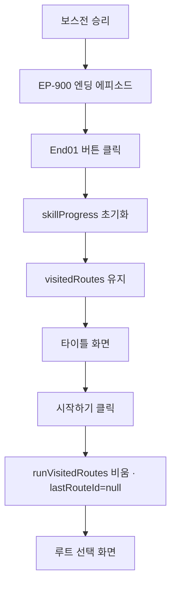
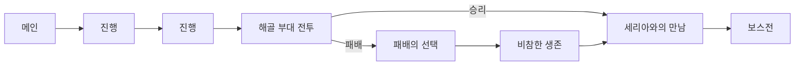
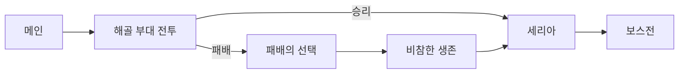
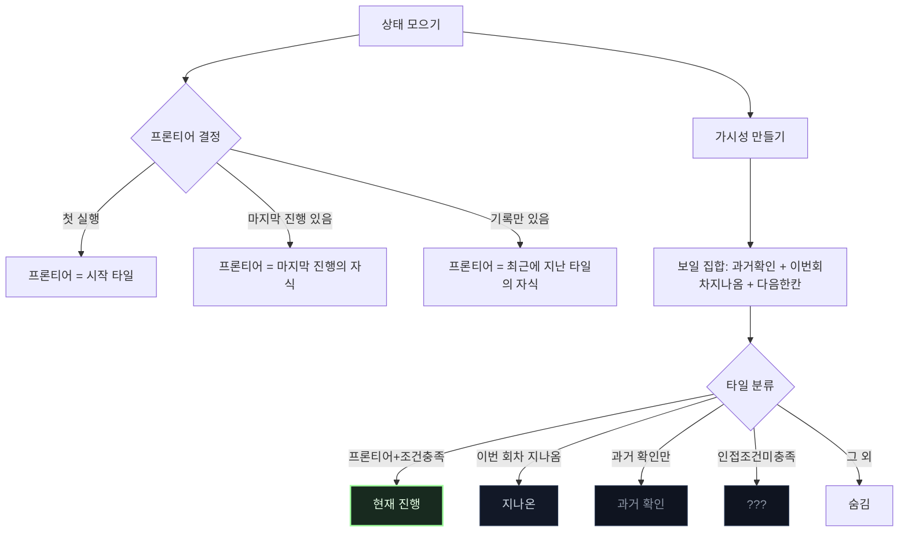

## 상위/연관
- 상위: [[GDD/[IDX] 인덱스]]  
- 연관: [[GDD/UX/[UX] 루트 선택 UI]] · [[GDD/콘텐츠/[CNT] 에피소드 타일]] · [[GDD/시스템/[SYS] 턴제 전투 시스템]] · [[GDD/시스템/[SYS] 부대 정비]] · [[GDD/시스템/[SYS] 상태 지속]] · [[GDD/데이터/[DATA] 데이터 모델 가이드]]

## 본문(병합)
스토리는 이벤트 조건에 따라서 분기된다.

![[UI_스토리분기.png]]

... 상세 규칙/데이터/검증/워크플로우는 최신 사양을 본 문서에서 유지한다.

---

## 상세 사양(병합 본문)

## 세부 문서 링크(접두어 구조)
- [[GDD/[IDX] 인덱스]]
- [[GDD/시스템/[SYS] 스토리 분기 시스템]]
- [[GDD/UX/[UX] 루트 선택 UI]]
- [[GDD/콘텐츠/[CNT] 에피소드 타일]]
- [[GDD/시스템/[SYS] 턴제 전투 시스템]]
- [[GDD/시스템/[SYS] 부대 정비]]
- [[GDD/시스템/[SYS] 상태 지속]]
- [[GDD/데이터/[DATA] 데이터 모델 가이드]]

---

## 목적
- **UI_스토리분기.png**를 기반으로 스토리 분기(Branch) 시스템의 설계/운영 기준을 정의한다.
- 작성자/디자이너/프로그램/QA가 공통으로 참조하는 단일 소스 역할을 한다.

## 최근 업데이트(최종)
- 해골 부대 전투(BT-200) 패배 루트 고도화: `EP-205(패배의 선택)`, `EP-210(비참한 생존)`, `EP-220(숭고한 희생)` 추가. `loseNext:'EP-205'` 경로가 안정적으로 동작.
- 재합류 OR 조건 지원: `checkRequirements`가 `anyOf`를 인식하여 OR 게이트 구성 가능. 패배 루트에서도 “세리아와의 만남(R-300/EP-300)”로 재합류 허용.
- 루트 UI 상태키 보강: `activeRouteId` 도입. 현재 진행 중인 에피소드로 진입한 경로를 포커스 대상으로 유지하며, 가시성 집합에 항상 포함하고 클릭 비활성화(`inProgress`).
- 스타일 우선순위 확정: `.historic`은 `visited && !passed`에 해당할 때 항상 적용되며, 우선순위는 `current > passed > historic > obf`로 결정. 클래스 조합 충돌을 방지하도록 렌더 시 명시적 순서로 적용.
- 회차 관리 규칙: 엔딩(`END-01`) 클릭 시 `skillProgress`만 초기화, `visitedRoutes`는 유지. 타이틀에서 “시작하기” 시 `runVisitedRoutes` 초기화, `lastRouteId=null`로 새 회차 시작.

## 핵심 개념
- **노드(Node/분기 타일)**: 하나의 스토리 단위(씬, 이벤트, 전투, 컷씬 등). 시작/중간/엔딩 노드로 구분.
- **엣지(Edge/연결선)**: 노드 간 흐름을 연결. 선택지 또는 자동진행. 조건과 라벨을 가질 수 있음.
- **조건(Condition)**: 분기 충족 요건. 플래그/스탯/아이템/시간/호감도/선행노드 완료 등으로 구성.
- **효과(Effect)**: 노드 진입/탈출 시 게임 상태 변화(플래그 세팅, 자원 증감, 호감도 변화, 퀘스트 갱신 등).
- **상태(State)**: 노드/엣지의 접근 가능성. 잠김(locked)/해금(unlocked)/진행중(in-progress)/완료(done)/실패(failed)/숨김(hidden).
- **카테고리/태그**: 메인/서브, 장/절, 난이도, 지역, 인물 등 탐색/필터용 메타데이터.

## UI 구성
- **캔버스/미니맵**: 전체 분기 지형을 조망, 드래그/줌 지원.
- **노드 카드**: 제목, 요약, 아이콘, 상태, 태그 표시. 입/출력 포트 제공.
- **전투 타일 마크**: 전투로 이어지는 루트(`next`가 `BT-` 시작)는 제목 앞에 ⚔ 아이콘을 표기해 시각적 구분.
- **엣지 라벨**: 선택지 텍스트 또는 조건 요약 표기. 충족 불가 시 시각적 경고.
- **사이드 패널**: 노드/엣지 선택 시 상세 속성 편집(본문, 조건, 효과, 테스트 결과 등).
- **상단 툴바**: 검색/필터, 검증(Validate), 시뮬레이션(Playtest), 버전 스냅샷, 정렬(Layout).
- **잠금 표시**: 텍스트+아이콘 병기, Hover 시 상세 툴팁.
 - **레이아웃**: 우향 계층형 자동 레이아웃(깊이별 칼럼, 동심/격자 혼합 간격), 라벨/곡선 엣지.
 - **자동 간격 조절**: 노드 수에 따라 칼럼/행 간격을 동적으로 산정(상/하한 포함).
 - **미니맵 프레임 드래그**: 미니맵에서 프레임을 드래그하면 뷰포트가 즉시 이동.

### 가시성 규칙(미탐/다음/기탐)
- 미탐색(처음 보는) 노드: 화면에 표시하지 않음(엣지도 함께 숨김).
- 다음 진행 후보 노드: 이전 노드가 방문되었으나 조건 미달일 때만 카드 제목을 “???”로 표시(`obf`). 조건을 충족해 선택 가능한 노드는 원래 제목을 표시한다.
- 방문한 노드: 원래 제목/요약 표시, `visited` 스타일(디밍/점선 테두리). 현재 노드는 `current` 강조.
- 조건 미달 노드: `locked` 상태로 비활성화(클릭 불가). 플래그 요구조건은 값 존재+일치해야 충족.
- 방문 정보 저장: `state.flags.visitedRoutes[routeId]=true`에 기록.

### 상호작용(팬/줌)
- 팬 임계치: 마우스 드래그 이동은 4px 이상 움직일 때만 팬으로 인식. 단순 클릭 시 화면 배율/위치는 변하지 않는다.
- 휠 줌: 커서 위치 기준으로 확대/축소, 미니맵 뷰포트와 동기화.

## 상호작용 규칙
- 노드 생성/삭제, 다중 선택, 정렬(격자 스냅), 자동 레이아웃(계층/방사형) 지원.
- 엣지 연결 시 타입 선택: 자동/선택지/확률/우선순위.
- 조건/효과는 템플릿으로 저장 후 재사용. 조건 세트는 AND/OR/NOR 조합 가능.
- 시뮬레이션: 시작 노드 지정 → 현재 상태(플래그/스탯) 세팅 → 가상 진행 → 유효/무효 경로 하이라이트.
- 검증: 고아 엣지, 미도달 노드, 막힌 엔딩, 순환 루프, 조건 충돌 자동 탐지.

## 데이터 모델(예시)
```json
{
  "nodes": [
    {
      "id": "N-001",
      "type": "story",          
      "title": "프롤로그",
      "summary": "세계/목표 소개",
      "state": "unlocked",
      "tags": ["메인", "1장"],
      "requirements": [],
      "onEnterEffects": [
        { "type": "flag.set", "key": "intro.cleared", "value": false }
      ],
      "onExitEffects": []
    }
  ],
  "edges": [
    {
      "id": "E-001",
      "from": "N-001",
      "to": "N-010",
      "kind": "choice",
      "label": "정면 돌파한다",
      "priority": 10,
      "conditions": [
        { "type": "stat", "key": "용기", "op": ">=", "value": 3 }
      ],
      "effects": [
        { "type": "stat.add", "key": "명성", "value": 1 }
      ]
    }
  ]
}
```

## 조건 시스템
- **플래그**: flag.set/get, 존재/값 비교 지원.
- **스탯/리소스**: 수치 비교(=, ≠, >, ≥, <, ≤), 소모/회복 옵션.
- **아이템**: 소지/수량, 장비 여부, 내구도.
- **호감도/관계**: 캐릭터별 친밀도 범위.
- **시간/캘린더**: 장/일차/시간대, 마감 기한.
- **선행/배제**: 특정 노드 완료/실패 여부, 중복 진행 방지.
- **확률**: 가중치 기반 분기. 시드 고정(재현성 보장).

### OR 조건(anyOf) 예시(현행 사용)
```json
{
  "requirements": [
    {
      "anyOf": [
        { "type": "flag", "key": "bt.BT-200.win", "value": true },
        { "type": "flag", "key": "ep.EP-210.done", "value": true }
      ]
    }
  ]
}
```

## 결과(Effect) 타입
- 플래그/스탯/아이템/호감도/퀘스트/지도 해금/전투 호출/미니게임 호출/엔딩 플래그/체크포인트 저장.
- 효과 실행 시점: onEnter, onExit, onEdge. 롤백 정책: 실패 시 트랜잭션 취소.

## 우선순위와 충돌 처리
- 동일 노드의 다중 엣지 평가: 조건 충족 → 우선순위 내림차순 정렬 → 가장 높은 경로 선택.
- 디폴트 경로: 조건 미충족 시 fallback 엣지로 이동(명시 필요).
- 상호 배타 선택지: 동일 그룹 키를 공유하면 동시 선택 금지.

## 저장/재진입 규칙
- 체크포인트 노드 지정 가능. 재시도 시 onEnter 효과 재실행 여부를 노드별 옵션으로 관리.
- 루프 허용 노드는 최대 반복 수/쿨다운을 명시.

## 게임 오버(배드 엔딩) 처리
- 배틀 결과가 배드 엔딩 노드(예: `EP-220`)로 이어질 경우, 게임을 초기화하고 타이틀 화면으로 이동한다.
- 초기화 시에도 한 번이라도 본 적이 있는 루트(visitedRoutes)는 숨김 처리하지 않고 그래프에 표시한다.

## 타이틀 화면
- 단순 시작 화면 제공(“시작하기” 버튼). 클릭하면 루트 선택 화면으로 이동.

### 엔딩/재시작 플로우(Top-Down)


## 제작 워크플로우
1) 노드 초안 작성(제목/요약/본문)  
2) 엣지 연결 및 라벨링  
3) 조건/효과 템플릿 적용  
4) 자동 정렬 및 가독성 점검  
5) 검증기 실행(오류 0개 목표)  
6) 시뮬레이션 경로 캡처(주요 루트)  
7) 리뷰/피드백 반영 후 버전 스냅샷 생성

## QA 체크리스트
- 시작 노드가 정확히 1개인지 확인.
- 도달 불가 노드 0개, 고아 엣지 0개.
- 루프 노드 반복 한도/탈출 경로 존재.
- 모든 선택지에 명확한 라벨과 피드백 텍스트 존재.
- 조건 라벨과 실제 조건 로직 일치.
- 로컬라이제이션 키 누락 없음.

## 예시 시나리오(축약)
- N-001 프롤로그 → [선택지A: 정면] → N-010 훈련장  
- 조건 미충족 시 → N-005 우회 루트(튜토리얼 강화)  
- N-010 성공 시 플래그 intro.cleared=true, 실패 시 실패 루트로 분기

## 메트릭/로그
- 선택지 클릭률, 조건 충족률, 노드 체류 시간, 엔딩 분포, 막힌 루트 비율.
- 시뮬레이터 결과와 실플레이 로그 비교로 밸런싱.

## 버전/협업
- 노드/엣지 개별 수정 이력과 변경 사유 기록.
- 위험 변경(조건/효과/엔딩)은 변경 전 스냅샷 필수.


---

## 그래프/레이아웃 가이드(디자이너용)

### 한눈에 보기(개념도)


### 그래프 작성 규칙(간단)
- **노드**: 이야기 단위 타일(전투/에피소드/선택지). 제목·요약만 신경 쓰면 됩니다.
- **연결(엣지)**: 
  - 메인 흐름은 타일의 `진행` 연결(오른쪽으로 이어집니다)
  - 분기는 타일의 `브랜치` 연결(예: 승리/패배)
- **가시성**:
  - 처음엔 시작 타일만 보입니다
  - 진행하면서 “이미 본 타일”과 “그 다음 타일 1단계”가 보입니다
  - 조건 미달 타일은 제목이 `???`

### 레이아웃(배치) 원칙
- **X(가로)**
  - 메인 라인은 일정 간격으로 오른쪽으로만 이어집니다
  - 브랜치는 “부모 타일 바로 오른쪽 칼럼”에 배치됩니다
  - 모든 연결은 “자식이 부모보다 오른쪽”입니다(뒤로 가지 않음)
- **Y(세로)**
  - 부모 아래에 자식들이 묶여 보이도록 군집 정렬합니다
  - 메인 라인은 한 줄로 곧게 유지합니다(세리아 같은 메인 타일이 내려가지 않음)
  - **재합류** 타일은 “주부모”의 줄에 맞춥니다
    - 주부모: 메인 라인에 있는 부모 → 없으면 라벨이 `진행/승리`인 부모 → 그래도 없으면 첫 부모

시각 예시


### 선(엣지) 그리기 규칙
- 같은 줄(Y 동일)은 **직선**
- 줄이 다르면 **한 번 꺾어서(H→V→H)** 연결합니다
- 선이 타일을 가로지르지 않도록, 꺾는 기둥(수직 레일)은 해당 구간의 타일 오른쪽 바깥에서 내려옵니다
- 코너는 둥글게(라운딩) 처리되어 흐름이 자연스럽게 보입니다

### 조건(잠금) 필수 팁
- 재합류를 허용해야 하는 타일은 **OR 조건**으로 열어주세요
  - 예: “세리아와의 만남” = (BT-200 승리) **또는** (패배 루트 비참한 생존 완료)
- 패배/엔딩 분기에서 필요한 플래그는 에피소드 종료 시점에 세팅합니다(예: `EP-210 완료`)

### 조절 가능 값(디자이너 참고)
- 가로 간격, 세로 간격, 꺾는 기둥 여백, 코너 둥글기(라운딩 반경)
- 목적: 과밀/과도한 공백을 피하고 흐름이 한눈에 들어오도록 조정

### 제작 체크리스트
- **배치**: 메인은 한 줄, 브랜치는 부모 바로 오른쪽 칼럼
- **재합류**: 주부모 줄로 정확히 합류(메인 타일이 내려가면 안 됨)
- **선**: 타일을 관통하지 않음, 꺾임은 1회(H→V→H)
- **가시성**: 아직 볼 수 없는 타일은 `???`, 이미 본 타일은 흐리게(visited)
- **조건**: 승/패/선택에 따른 플래그가 정확히 세팅되어 다음 흐름이 자연스럽게 열림

## 루트 선택 UI 가시성/스타일 플로우(상세)

본 섹션은 실제 구현(`routes.js`, `styles.css`) 기준으로 “본 것/안 본 것/현재 진행 중” 타일을 어떻게 판정하고 렌더링/스타일링하는지의 전체 흐름을 설명한다.

### 상태 키(요약)
- visitedRoutes: 과거에 한 번이라도 확인한 루트(영구). 집합 S_v
- runVisitedRoutes: 이번 회차에서 실제로 밟은 루트(지나온 타일). 집합 S_r
- lastRouteId: 이번 회차에서 마지막으로 밟은 루트의 id(프론티어 기준점)
- startId: 시작 루트 id

### 가시성/분류 절차
- 1) 상태 모으기
  - 과거에 한 번이라도 본 타일(visited), 이번 회차에 실제로 지나온 타일(passed), 마지막으로 밟은 타일(last), 시작 타일(start)
- 2) 프론티어 결정(“지금 갈 차례인 후보”)
  - 이번 회차가 아직 시작 전이라면 → 프론티어 = 시작 타일
  - 마지막으로 밟은 타일이 있다면 → 그 타일의 자식들
  - 마지막 정보가 없고 지나온 기록만 있다면 → 지나온 것 중 가장 최근 타일의 자식들
- 3) 무엇을 화면에 보일지 결정(가시성)
  - 과거에 본 타일 + 이번 회차에 지나온 타일 + 그 다음 한 칸(자식들)
- 4) 각 타일에 스타일 붙이기
  - 프론티어이고 조건을 만족 → “현재 진행”(.current)
  - 이번 회차에 지나옴 → “지나온”(.passed)
  - 과거에 봤지만 이번 회차는 안 지남 → “과거 확인”(.historic)
  - 인접하지만 조건 미충족 → “미확인(???)”(.obf)
  - 나머지 → 화면에 표시하지 않음(숨김)
- 5) 타일 클릭 시
  - 과거 확인/이번 회차 지나온/마지막 진행 정보를 갱신하고, 다음 EP/BT 화면으로 이동한다(중계 루트가 있으면 먼저 중계 루트를 처리).

### 포커스/진행 상태 키 보강
- `activeRouteId`: 현재 표시 중인 에피소드로 진입한 경로 id. 가시성 집합에 항상 포함, `inProgress`로 표기, 클릭 불가.
- `lastRouteId`: 이번 회차에서 최근에 지난 경로 id. 프론티어 계산의 기본 기준.
- `visitedRoutes`: 영구 이력(한 번이라도 봄). 항상 가시성에 포함.
- `runVisitedRoutes`: 이번 회차 이력(지나온). `.passed` 스타일 적용.

### 스타일 적용 우선순위(충돌 방지)
- 1) `.current`
- 2) `.passed`
- 3) `.historic` (조건: `visited && !passed` → 항상 흐릿 처리)
- 4) `.obf`

### 머메이드 플로우(Top-Down)


### 노드 타일 타입(현행)
| 타입               | 클래스         | 가시성 | 설명                                |
| ---------------- | ----------- | --- | --------------------------------- |
| 현재 진행            | `.current`  | 보임  | 프론티어 중 요구조건 충족. 네온 그린 테두리, 불투명도 1 |
| 지나온(이번 회차)       | `.passed`   | 보임  | 이번 회차에 실제로 밟은 타일. 일반 타일 스타일 유지    |
| 과거 확인(이번 회차 미진행) | `.historic` | 보임  | 과거에 봤지만 이번 회차엔 안 밟음. 어둡고 흐릿       |
| 인접 미확인           | `.obf`      | 보임  | baseVisible의 자식이지만 조건 미충족. 라벨 ??? |
| 숨김               | 없음          | 숨김  | 위 조건에 해당하지 않는 노드(가시성 집합 밖)        |
### 스타일 클래스 매핑(`styles.css`)
- .node.current: 현재 진행 중(프론티어 중 요구조건 충족) → 네온 그린 테두리, 불투명도 1
- .node.passed: 이번 회차에 지나온 타일(S_r) → 일반 타일과 동일한 어두운 테두리
- .node.historic: 과거 확인(S_v)이나 이번 회차는 미진행 → 어둡고 흐릿(불투명)
- .node.obf: 인접 미확인(가시성 있음·조건 미충족) → 타일/텍스트 불투명, 라벨 ???

### 디자이너용 확인 포인트
- 프론티어는 “이번 회차 마지막 진행(lastRouteId)의 자식”을 우선 기준으로 한다.
- 회차 시작엔 start만 보이며, 과거 확인(S_v)은 항상 가시성에 포함된다.
- 클래스와 라벨은 위 분류 규칙에 정확히 대응한다: current/ passed/ historic/ obf.
