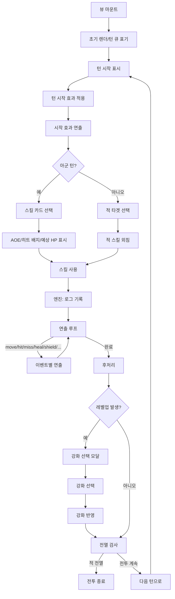

## 목적/범위
- 전투 중 발생하는 시각 효과(하이라이트, 비네팅, 데미지/힐 플로팅, 이동/사망 애니메이션, 모달 표시)를 일관된 규칙과 순서로 처리한다.
- UI/엔진 사이의 이벤트 기반 연동 규칙과, 디바운스/부분 리렌더 전략을 문서화한다.

## 핵심 개념
- 로그 기반 시퀀싱: 엔진은 `battleState.log`에 이벤트를 기록하고, 뷰는 이를 읽어 순차 연출한다.
- 부분 리렌더: 애니메이션 중 전체 리렌더를 피하고, 필요한 레인/요소만 갱신한다.
- 차단형 모달: 레벨업 등 진행을 멈춰야 하는 상황에서는 모달이 닫힐 때까지 플로우를 차단한다.
- 디바운스: 적 턴 루프 말미의 리렌더는 짧게 지연하여 연출 누락/충돌을 방지한다.

## 이벤트 타입(현행)
- `hit/miss`: 타격/빗나감 연출, HP/실드 바 반영, 데미지/미스 플로팅 텍스트.
- `move`: `.unit-slot.moving` 적용 → 240ms 슬라이드 → 해당 레인 부분 리렌더.
- `dead`: 슬롯 페이드 아웃 후 제거, 사망 이펙트(💀), 큐/배치에서 제거.
- `heal/shield`: HP/실드 바 즉시 반영, 힐/실드 플로팅 텍스트.
- `poison/poisonTick`, `bleed/bleedTick`: 아이콘 생성/턴수 갱신/틱 피해 반영.
- `skillLevelUp`: 스킬 강화 모달 표출(차단).

## 시각 규칙(샘플)
- 현재 턴: `.is-turn`(아군/적군 모두 이름 라벨 노출).
- AOE 하이라이트: 대상 집합에 `.is-aoe` 적용.
- 50% 이하 명중률: 히트 배지 `.low-hit` 적용.
- 적 스킬 외침: 공격 직전 말풍선 출력.

## 전체 연출 플로우

## 공격 연출 상세(구현 기준)

### 핵심 엔드포인트
- 뷰: `renderBattleView()` 내부
  - 플레이어 사용: `executeSelectedSkill()`
  - 적 자동: `runEnemyPhase()`
- 엔진: `window.BATTLE.performSkill(state, B, actor, skill)` → `B.log`에 이벤트 기록
- 로그 소비: `animateFromLog()`

### 플레이어 공격 단계
1) 카드 선택 → 다시 클릭 시 사용 가능 검사(`canExecute`) 통과
2) `executeSelectedSkill()` 실행
   - 선택 스킬 확정(필요시 이동 타겟팅 종료/툴팁 숨김)
   - 배우 말풍선(선언 대사) 출력
   - 즉시 `performSkill()` 호출 → 엔진이 `B.log`에 이벤트 푸시
   - `animateFromLog()` 호출로 시각 연출 시작, 완료 대기
   - 레벨업 모달 대기 플로우 처리(모달 닫히면 남은 로그 재생)
   - 턴 시작 효과(`applyTurnStartEffects`) 및 그 로그도 동일 루틴으로 재생
   - 승패 검사 후 다음 단계로 진행

### 적 공격 단계
1) `runEnemyPhase()` 루프 내 현재 턴 적 선택/타겟 픽
2) 공격 직전 연출
   - 슬롯에 `.attacking` 부여
   - 스프라이트 상태: `applyPortraitState(unitId, 'attack')`
   - 돌진/복귀 애니메이션: `.inner` 요소에 40px 전진 후 복귀(ally는 +X, enemy는 -X)
3) `performSkill()` 호출 → `B.log` 이벤트 푸시 → `animateFromLog()` 재생 대기
4) 공격 종료 후 `.attacking` 제거, 스프라이트 `default` 복귀
5) 레벨업 모달 대기, 승패 검사, 다음 적으로 루프

### 로그 기반 시퀀싱(animateFromLog)
- 이벤트 큐: `const events = B.log`
- 세대 토큰: `B._animGen`으로 재호출간 충돌 방지
- 멀티히트 지연: `step = 500ms`, `ev.isMulti === true`인 `hit/miss`는 순차 지연(`seqDelay += step`)
- 예상 표시 시간
  - `hit/miss/skillLevelUp/shield`: 약 300ms
  - `dead`: 800ms (슬롯 페이드와 동기)
- 처리 후 `B.log.length = 0`

### 이벤트별 표현(뷰)
- move
  - 대상 슬롯에 `.moving` → 240ms 슬라이드 후 해제
  - 전체 리렌더 대신 해당 레인만 부분 리렌더(`renderRows(allyLane/enemyLane)`)
- hit
  - 대상 슬롯에 비네팅 `.is-aoe`(짧게) + `.impact`
  - HP/실드 바 즉시 반영(로그 내 hp/shield 값 우선)
  - 피격 텍스트(치명/블록 변형 포함) 플로팅
  - 피격 스프라이트: `applyPortraitState(toId, 'hit')` → 240ms 뒤 `default`
- miss
  - 대상에 `MISS` 플로팅, 공격자에 `lunge-*` 키프레임 적용
- dead
  - 슬롯 `.fade-out` 800ms 후 고스트 전환(레이아웃 유지용, 클릭 차단)
- heal/shield
  - 바 수치 반영 + 플로팅 텍스트
- poison/bleed(+Tick)
  - 아이콘 생성/갱신 및 틱마다 남은 턴 감소/제거
- skillLevelUp
  - 차단형 모달 표시 → 선택 시 `state.skillProgress`에 즉시 반영

### 스프라이트/HP바/클릭 규칙
- 스프라이트 소스: 유닛 `sprite`(base/attack/hit) → 없으면 기본값
- 상태 전환: `default ↔ attack/hit`를 뷰에서 직접 호출하여 즉시 반영
- HP바: 슬롯 상단 위 6px 지점, 폭 48%, 높이 3px, 클릭 차단(pointer-events:none)
- 클릭 히트박스: `.unit-slot`만 클릭 수신
  - `.portrait`, `.hpbar`, `.shieldbar`: pointer-events:none
  - 고스트 슬롯: pointer-events:none(배치 유지만)

### 멀티히트 처리
- 엔진이 `isMulti:true`를 붙여 여러 `hit/miss` 이벤트를 순차 기록
- 뷰는 `step(500ms)` 단위로 순차 재생 → 각 히트마다 돌진/피격/바 반영이 반복됨
- 마지막 이벤트까지 재생이 끝나면 다음 후속 처리(레벨업/턴 시작 효과/다음 턴)로 진행

## 엔진 연동 포인트
- `performSkill`: 스킬 사용 시점에 로그를 순서대로 푸시한다.
- `applyTurnStartEffects`: 독/출혈/재생/실드 만료 등을 처리하고 로그를 남긴다.
- `isBattleFinished`: 적·아군 전멸 여부 판단.

## 뷰 연출 전략
- `animateFromLog()`: 로그를 읽어 이벤트별로 DOM을 갱신하고 애니메이션 클래스를 적용한다.
- 레인 부분 리렌더: 이동/사망 후 전체가 아닌 해당 레인만 재렌더.
- 적 턴 말미 디바운스: 애니메이션 충돌 방지 위해 짧은 지연 후 재렌더 스케줄.

## 체크리스트
- [ ] 멀티히트 순차 연출이 누락 없이 재생된다.
- [ ] 이동 애니메이션 도중 전체 리렌더가 발생하지 않는다.
- [ ] 레벨업 모달 표시 중 진행이 멈춘다.
- [ ] 전멸 후 즉시 승/패 모달이 뜬다.
- [ ] 독/출혈 아이콘과 남은 턴 수가 즉시 갱신된다.

