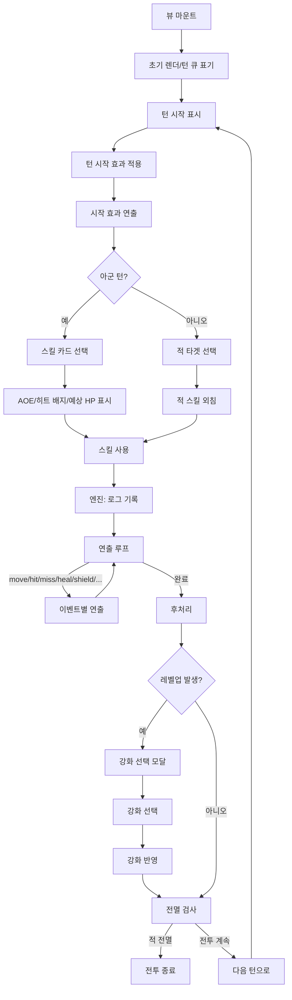

## 목적/범위
- 전투 중 발생하는 시각 효과(하이라이트, 비네팅, 데미지/힐 플로팅, 이동/사망 애니메이션, 모달 표시)를 일관된 규칙과 순서로 처리한다.
- UI/엔진 사이의 이벤트 기반 연동 규칙과, 디바운스/부분 리렌더 전략을 문서화한다.

## 핵심 개념
- 로그 기반 시퀀싱: 엔진은 `battleState.log`에 이벤트를 기록하고, 뷰는 이를 읽어 순차 연출한다.
- 부분 리렌더: 애니메이션 중 전체 리렌더를 피하고, 필요한 레인/요소만 갱신한다.
- 차단형 모달: 레벨업 등 진행을 멈춰야 하는 상황에서는 모달이 닫힐 때까지 플로우를 차단한다.
- 디바운스: 적 턴 루프 말미의 리렌더는 짧게 지연하여 연출 누락/충돌을 방지한다.

## 이벤트 타입(현행)
- `hit/miss`: 타격/빗나감 연출, HP/실드 바 반영, 데미지/미스 플로팅 텍스트.
- `move`: `.unit-slot.moving` 적용 → 240ms 슬라이드 → 해당 레인 부분 리렌더.
- `dead`: 슬롯 페이드 아웃 후 제거, 사망 이펙트(💀), 큐/배치에서 제거.
- `heal/shield`: HP/실드 바 즉시 반영, 힐/실드 플로팅 텍스트.
- `poison/poisonTick`, `bleed/bleedTick`: 아이콘 생성/턴수 갱신/틱 피해 반영.
- `skillLevelUp`: 스킬 강화 모달 표출(차단).

## 시각 규칙(샘플)
- 현재 턴: `.is-turn`(아군/적군 모두 이름 라벨 노출).
- AOE 하이라이트: 대상 집합에 `.is-aoe` 적용.
- 50% 이하 명중률: 히트 배지 `.low-hit` 적용.
- 적 스킬 외침: 공격 직전 말풍선 출력.

## 전체 연출 플로우

## 엔진 연동 포인트
- `performSkill`: 스킬 사용 시점에 로그를 순서대로 푸시한다.
- `applyTurnStartEffects`: 독/출혈/재생/실드 만료 등을 처리하고 로그를 남긴다.
- `isBattleFinished`: 적·아군 전멸 여부 판단.

## 뷰 연출 전략
- `animateFromLog()`: 로그를 읽어 이벤트별로 DOM을 갱신하고 애니메이션 클래스를 적용한다.
- 레인 부분 리렌더: 이동/사망 후 전체가 아닌 해당 레인만 재렌더.
- 적 턴 말미 디바운스: 애니메이션 충돌 방지 위해 짧은 지연 후 재렌더 스케줄.

## 체크리스트
- [ ] 멀티히트 순차 연출이 누락 없이 재생된다.
- [ ] 이동 애니메이션 도중 전체 리렌더가 발생하지 않는다.
- [ ] 레벨업 모달 표시 중 진행이 멈춘다.
- [ ] 전멸 후 즉시 승/패 모달이 뜬다.
- [ ] 독/출혈 아이콘과 남은 턴 수가 즉시 갱신된다.

