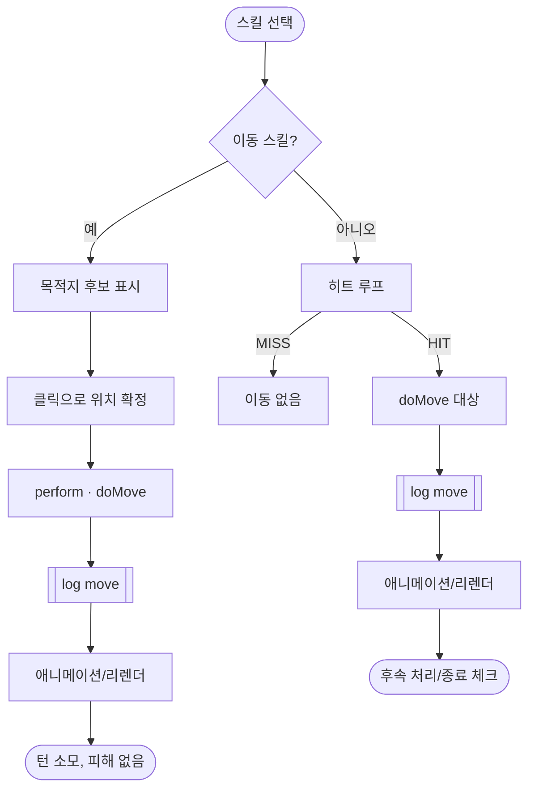

### 타일 이동 시스템

본 문서는 턴제 전투 시스템의 하위 모듈로, 스킬 기반 타일 이동 규칙과 UI/연출/데이터 구조를 정의한다. 이동은 크게 두 종류다.

- **능동 이동(active move)**: 사용자가 목적지를 선택해 자신의 유닛을 이동한다. 피해 없음.
- **온히트 이동(on-hit move)**: 공격이 적중했을 때 대상이 이동한다. miss면 이동 없음.

연관 문서: [[SYS] 턴제 전투 시스템]], [[SYS] 상태 지속]], [[SYS] 스토리 분기 시스템]]

데이터 구조(요약)
- 스킬(`skills.js`)
  - `move`: `{ who:'actor'|'target', dir:'forward'|'back'|'up'|'down'|대각, tiles:number, required:boolean, allowedDirs?:string[] }`
    - `who`: 이동 주체. 배우(시전자) 또는 대상.
    - `dir`, `tiles`: 기본 방향/칸 수. 능동 이동은 `allowedDirs`로 후보를 제공.
    - `required`: true면 이동이 불가할 때 스킬 사용 자체가 불가.
    - 내부 전용: 능동 이동 시 선택 좌표를 `__dest`로 엔진에 전달(뷰→엔진 인터페이스용).

- 배틀 상태(`battleCore.js`)
  - `previewMove(state, B, unitId, moveSpec) → { steps, path, final }`
  - `doMove(moverId, moveSpec)` 내부 유틸(로그에 `{type:'move', from, to}` 기록)

흐름(플로우)

판정 규칙
- **경계/충돌**: 3x3 격자 내로 클램프. 목표 칸이 점유되어 있으면 이동 불가. 2칸 이상 이동은 경유 칸이 막히면 가능한 지점까지만 이동.
- **required**: 이동이 필요한 스킬이고 경로가 막히면 스킬 사용 불가(능동/온히트 동일 규칙, 온히트는 사전검증 불가한 광역의 경우 개별 대상에서 건너뜀).
- **명중 의존**: 온히트 이동은 적중 시에만 발생. 능동 이동은 피해/명중과 무관.

UI/연출
- 후보 타일: `.slot.move-candidate`로 표시(점선/배경 하이라이트).
- 이동 애니메이션: 이동 로그 수신 시 `.unit-slot.moving` 클래스 → 240ms 슬라이드.
- 애니메이션 종료 후 라인만 부분 리렌더(ally/enemy lane) → 최신 위치 반영.

엔진 훅(요약)
- `performSkill`
  - actor 선이동(`who:'actor'`)은 스킬 시작 시 한 번 처리.
  - 온히트 이동(`who:'target'`)은 히트 루프 내 첫 적중 시 처리.
  - 순수 이동(type==='move')은 피해 계산을 건너뜀.
- `applyTurnStartEffects`는 DOT/HoT만 처리. 이동 없음.

검증 포인트(체크리스트)
- [ ] miss 시 대상 이동이 발생하지 않는다.
- [ ] required=true 스킬은 이동 경로가 막히면 사용 불가 표시.
- [ ] 능동 이동은 빈 칸만 하이라이트되고, 클릭한 칸으로 정확히 이동한다.
- [ ] 이동 로그가 즉시 애니메이션을 트리거하고 화면에 반영된다.
- [ ] 전투 종료 조건은 이동 후에도 정상 체크되어 승/패 모달이 뜬다.

테이블: 방향/델타 매핑

| dir       | 행 변화(dr) | 열 변화(dc) |
| --------- | -------- | -------- |
| forward   | -1       | 0        |
| back      | +1       | 0        |
| up        | 0        | -1       |
| down      | 0        | +1       |
| upLeft    | -1       | -1       |
| upRight   | -1       | +1       |
| downLeft  | +1       | -1       |
| downRight | +1       | +1       |

디자인 가이드
- 근접 전용 스킬은 `allowedRows`로 전열 제한을 권장.
- 원거리/마법 이동 연계 스킬은 on-hit 이동을 활용(넉백/끌어오기)하여 거리/배치 메타를 강화.
- 이동은 행동 1회를 소모하므로, 이동+공격이 함께 있는 스킬은 밸런스 상 개별 비용(쿨타임/MP/정확도)으로 보정.

